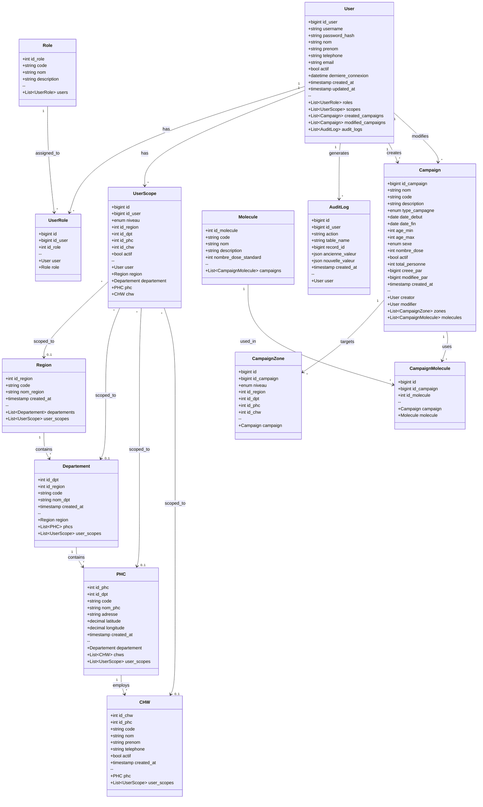
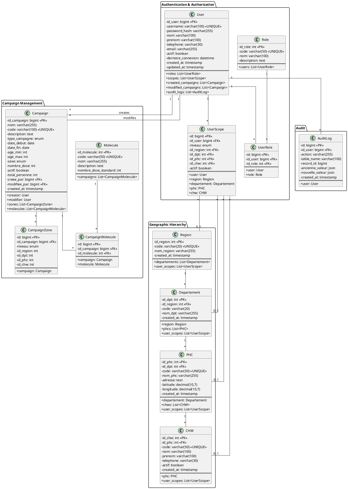

# Health Campaign Manager - Class Diagram

## UML Class Diagram (Mermaid)



## PlantUML Version



## ASCII Class Diagram

```
╔══════════════════════════════════════════════════════════════════════════════════════╗
║                           HEALTH CAMPAIGN MANAGER - CLASS DIAGRAM                      ║
╚══════════════════════════════════════════════════════════════════════════════════════╝

┌─────────────────────────────────────────────────────────────────────────────────────────┐
│                              AUTHENTICATION & AUTHORIZATION                              │
├─────────────────────────────────────────────────────────────────────────────────────────┤
│                                                                                          │
│  ┌──────────────────┐         ┌──────────────────┐         ┌──────────────────┐         │
│  │      Role        │         │    UserRole      │         │      User        │         │
│  ├──────────────────┤         ├──────────────────┤         ├──────────────────┤         │
│  │ - id_role: int   │◄────────│ - id: bigint     │────────►│ - id_user: bigint│         │
│  │ - code: string   │   1   * │ - id_user: FK    │ *   1   │ - username: str  │         │
│  │ - nom: string    │         │ - id_role: FK    │         │ - password_hash  │         │
│  │ - description    │         └──────────────────┘         │ - nom: string    │         │
│  └──────────────────┘                                      │ - prenom: string │         │
│                                                            │ - telephone: str │         │
│                                                            │ - email: string  │         │
│                              ┌──────────────────┐          │ - actif: bool    │         │
│                              │    UserScope     │          │ - derniere_conn  │         │
│                              ├──────────────────┤          │ - created_at     │         │
│                              │ - id: bigint     │◄─────────│ - updated_at     │         │
│                              │ - id_user: FK    │    1   * └──────────────────┘         │
│                              │ - niveau: enum   │                    │                  │
│                              │ - id_region: FK  │                    │ 1                │
│                              │ - id_dpt: FK     │                    │                  │
│                              │ - id_phc: FK     │                    ▼ *                │
│                              │ - id_chw: FK     │          ┌──────────────────┐         │
│                              │ - actif: bool    │          │    AuditLog      │         │
│                              └──────────────────┘          ├──────────────────┤         │
│                                       │                    │ - id: bigint     │         │
│                                       │ *                  │ - id_user: FK    │         │
│                                       │                    │ - action: string │         │
│                                       ▼ 0..1               │ - table_name     │         │
│                              ┌──────────────────┐          │ - record_id      │         │
│                              │ Geographic Refs  │          │ - ancienne_val   │         │
│                              └──────────────────┘          │ - nouvelle_val   │         │
│                                                            │ - created_at     │         │
│                                                            └──────────────────┘         │
└─────────────────────────────────────────────────────────────────────────────────────────┘

┌─────────────────────────────────────────────────────────────────────────────────────────┐
│                                  GEOGRAPHIC HIERARCHY                                    │
├─────────────────────────────────────────────────────────────────────────────────────────┤
│                                                                                          │
│  ┌──────────────────┐         ┌──────────────────┐         ┌──────────────────┐         │
│  │     Region       │         │   Departement    │         │       PHC        │         │
│  ├──────────────────┤         ├──────────────────┤         ├──────────────────┤         │
│  │ - id_region: int │────────►│ - id_dpt: int    │────────►│ - id_phc: int    │         │
│  │ - code: string   │   1   * │ - id_region: FK  │   1   * │ - id_dpt: FK     │         │
│  │ - nom_region     │         │ - code: string   │         │ - code: string   │         │
│  │ - created_at     │         │ - nom_dpt        │         │ - nom_phc        │         │
│  └──────────────────┘         │ - created_at     │         │ - adresse        │         │
│                               └──────────────────┘         │ - latitude       │         │
│                                                            │ - longitude      │         │
│                                                            │ - created_at     │         │
│                                                            └────────┬─────────┘         │
│                                                                     │                   │
│                                                                     │ 1                 │
│                                                                     │                   │
│                                                                     ▼ *                 │
│                                                            ┌──────────────────┐         │
│                                                            │       CHW        │         │
│                                                            ├──────────────────┤         │
│                                                            │ - id_chw: int    │         │
│                                                            │ - id_phc: FK     │         │
│                                                            │ - code: string   │         │
│                                                            │ - nom: string    │         │
│                                                            │ - prenom: string │         │
│                                                            │ - telephone      │         │
│                                                            │ - actif: bool    │         │
│                                                            │ - created_at     │         │
│                                                            └──────────────────┘         │
└─────────────────────────────────────────────────────────────────────────────────────────┘

┌─────────────────────────────────────────────────────────────────────────────────────────┐
│                                  CAMPAIGN MANAGEMENT                                     │
├─────────────────────────────────────────────────────────────────────────────────────────┤
│                                                                                          │
│  ┌──────────────────┐         ┌──────────────────┐         ┌──────────────────┐         │
│  │    Molecule      │         │CampaignMolecule  │         │    Campaign      │         │
│  ├──────────────────┤         ├──────────────────┤         ├──────────────────┤         │
│  │ - id_molecule    │◄────────│ - id: bigint     │────────►│ - id_campaign    │         │
│  │ - code: string   │   1   * │ - id_campaign:FK │ *   1   │ - nom: string    │         │
│  │ - nom: string    │         │ - id_molecule:FK │         │ - code: string   │         │
│  │ - description    │         └──────────────────┘         │ - description    │         │
│  │ - nombre_dose_   │                                      │ - type_campagne  │         │
│  │   standard       │                                      │ - date_debut     │         │
│  └──────────────────┘                                      │ - date_fin       │         │
│                                                            │ - age_min/max    │         │
│                                                            │ - sexe: enum     │         │
│                              ┌──────────────────┐          │ - nombre_dose    │         │
│                              │  CampaignZone    │          │ - actif: bool    │         │
│                              ├──────────────────┤          │ - total_personne │         │
│                              │ - id: bigint     │◄─────────│ - creee_par: FK  │         │
│                              │ - id_campaign:FK │    1   * │ - modifiee_par   │         │
│                              │ - niveau: enum   │          │ - created_at     │         │
│                              │ - id_region      │          └──────────────────┘         │
│                              │ - id_dpt         │                    │                  │
│                              │ - id_phc         │                    │                  │
│                              │ - id_chw         │                    ▼                  │
│                              └──────────────────┘          ┌──────────────────┐         │
│                                                            │      User        │         │
│                                                            │  (creator/mod)   │         │
│                                                            └──────────────────┘         │
└─────────────────────────────────────────────────────────────────────────────────────────┘

╔══════════════════════════════════════════════════════════════════════════════════════╗
║                                    LEGEND                                              ║
╠══════════════════════════════════════════════════════════════════════════════════════╣
║  ────────►  : One-to-Many relationship (1:N)                                          ║
║  ◄────────  : Many-to-One relationship (N:1)                                          ║
║  ◄────────► : Many-to-Many relationship (N:M) via junction table                      ║
║  PK         : Primary Key                                                              ║
║  FK         : Foreign Key                                                              ║
║  1   *      : Cardinality (one to many)                                               ║
║  *   1      : Cardinality (many to one)                                               ║
║  0..1       : Optional relationship                                                    ║
╚══════════════════════════════════════════════════════════════════════════════════════╝
```

## Enumerations

### niveau (UserScope & CampaignZone)
```
NATIONAL | REGION | DEPARTEMENT | PHC | CHW
```

### type_campagne (Campaign)
```
VACCINATION | DEPISTAGE | SUPPLEMENTATION | SENSIBILISATION | TRAITEMENT
```

### sexe (Campaign)
```
M | F | ALL
```

## Key Design Patterns

1. **Hierarchical Geographic Structure**: Region → Departement → PHC → CHW
2. **Role-Based Access Control (RBAC)**: Users have roles via UserRole junction table
3. **Scope-Based Authorization**: UserScope defines geographic access boundaries
4. **Audit Trail**: AuditLog tracks all data modifications with JSON snapshots
5. **Many-to-Many Relationships**: 
   - User ↔ Role (via UserRole)
   - Campaign ↔ Molecule (via CampaignMolecule)
